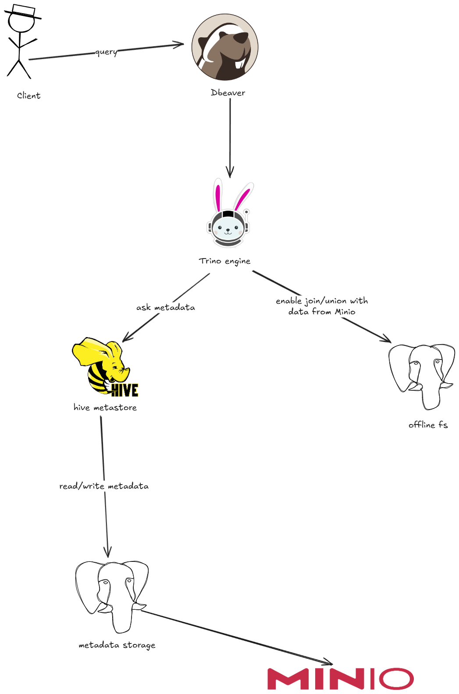
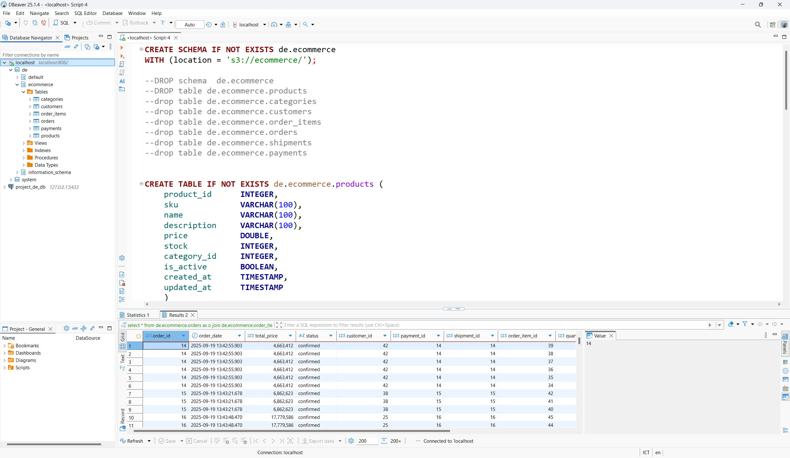

# READL TIME CUSTOMER BEHAVIOR RECOMMENDATION PLATFORM

## TABLE OF CONTENTS: 
### 0. [Introduction](#real-time-customer-behavior-recommendation-platform)
### 1. [Generate Dataset](#1-generate-dataset)
  - [1.1 Prerequisites](#11-prerequisites)
  - [1.2 Database Schema](#12-database-schema)
  - [1.3 Entity Diagram](#13-entity-diagram)
  - [1.4 Database Management](#13-database-management)
  - [1.5 Generate Database](#15-generate-database)
  - [1.6 User Behavior Simulation](#16-user-behavior-simulation)
  - [1.7 Check Data Via API](#17-check-the-data-via-the-api)
### 2. [Configuration for Capturing Data Changes](#2-configuration-capture-data-changes)
  - [ 2.1 Debezium Setup with PostgreSQL](#21-connect-debezium-with-postgresql-to-receive-any-updates-from-the-database)
  - [2.2 Testing Data Change Capture](#22-test-capture-change-data)
### 3. [Flink Jobs](#3-flink-jobs)
  - [3.1 Configuration](#31-configuration)
  - [3.2 Available Flink Jobs](#32-available-flink-jobs)
    - [3.2.1 Fraud Detection Job](#321-fraud-detection-job)
    - [3.2.2 Revenue Statistics Job](#322-revenue-statistics-job)
    - [3.2.3 Top Products Analysis Job](#323-top-products-analysis-job)
  - [3.3 Utility Components](#33-utility-components)
  - [3.4 Running Flink Jobs](#34-running-flink-jobs)
  - [3.5 Troubleshooting](#35-troubleshooting)
### 4. [Trino Query Engine](#4-trino-query-engine)
  - [4.1 Architecture Overview](#41-architecture-overview)
  - [4.2 Configuration Setup](#42-configuration-setup)
  - [4.3 Data Pipeline: PostgreSQL to MinIO](#43-data-pipeline-postgresql-to-minio)
  - [4.4 Schema Registration and Table Management](#44-schema-registration-and-table-management)
  - [4.5 Analytics and Query Examples](#45-analytics-and-query-examples)
  - [4.6 Performance Optimization](#46-performance-optimization)
  - [4.7 Troubleshooting](#47-troubleshooting)

### 5. [Spark Jobs](#5-spark-jobs)


## 1. Generate dataset
### 1.1 Prerequisites
- Setup environment : 
```bash
conda create -n <env_name> python=3.9 
``` 
- Activate environment: 
```bash
conda activate <env_name>
```
- Install libraries
```bash
pip install -r backend/requirements.txt
```
- Run services use docker compose: 
```bash 
docker compose -f docker/docker-compose-kafka.yml up -d
```

### 1.2 Database Schema
The database includes the following entities based on the ERD:

- **Customer**: User account information
- **Product**: Product catalog with categories
- **Category**: Product categories
- **Order**: Customer orders with items
- **OrderItem**: Individual items in orders
- **Cart**: Shopping cart functionality
- **Wishlist**: Customer wishlist
- **Payment**: Payment processing
- **Shipment**: Order shipping information

### 1.3 Entity Diagram

>See more details about how to design the database: https://vertabelo.com/blog/er-diagram-for-online-shop/
### 1.3 Database Management
- I use the database with Docker, you can configure the database in the file: `/backend/.env` depending on your database.
- Or you can run the `postgres` service in the `docker/docker-compose-kafka.yaml` file
```bash
# Initialize Table Database
python backend/utils/init_db.py --init
# Reset Database (Drop and recreate tables)
python backend/utils/init_db.py --reset
```

### 1.5 Generate database
- Here, I will create fixed data for the tables Categories, Customers, Products: 
```bash
# Create 15 categories, 200 products, 100 customers
python backend/generate_data.py --categories 15 --products 200 --customers 100
# or use the default setting
python backend/generate_data.py
# Delete all data
python backend/generate_data.py --clear
```
### 1.6 User behavior simulation
- I will simulate user behavior to create data for the remaining tables.
- Specific actions:
  - **Browsing**: View products, browse categories
  - **Cart Management**: Add/remove products from the cart
  - **Wishlist**: Add favorite products
  - **Order Placement**: Place orders from the cart
  - **Payment**: Process payment (credit card, paypal, etc.)
  - **Shipping**: Create shipping information
- Weights for each action:
  ```python
    action_weights = {
        'view_product': 0.4,      # 40% view products
        'add_to_cart': 0.2,       # 20% add to cart
        'add_to_wishlist': 0.15,  # 15% add to wishlist
        'remove_from_cart': 0.1,  # 10% remove from cart
        'place_order': 0.1,       # 10% order
        'browse_category': 0.05   # 5% browse category
    }
    ```
- Follow code below: 
```bash
# Simulate 50 shopping session, each session 25 minutes
python simulate_user_behavior.py --sessions 50 --duration 25
# Create history data 30 days
python simulate_user_behavior.py --historical 30
# Delete all data
python simulate_user_behavior.py --clear
```
### 1.7 Check the data via the API: 
- Run fastapi app and access to `http://localhost:8000/docs`: 
```bash
python backend/main.py
```
#### Basic Endpoints
- `GET /` - Root endpoint with API information
- `GET /health` - Health check
- `GET /docs` - Interactive API documentation
#### Data Endpoints
- `GET /customers` - List all customers
- `GET /products` - List all products  
- `GET /categories` - List all categories
- `GET /carts` - List all carts
- `GET /orders` - List all orders
- `GET /order_item` - List all order_item
- `GET /wishlist` - List all wishlist
- `GET /payment` - List all payment

## 2. Configuration Capture data changes
### 2.1 Connect Debezium with PostgreSQL to receive any updates from the database
```shell
bash config/cdc-connect/run.sh register_connector config/cdc-connect/postgresql-cdc.json
```
- You should see the output similar to the below example
```shell
Registering a new connector from configs/postgresql-cdc.json
HTTP/1.1 201 Created
Date: Sat, 13 Sep 2025 06:59:18 GMT
Location: http://localhost:8083/connectors/ecommere-cdc
Content-Type: application/json
Content-Length: 524
Server: Jetty(9.4.44.v20210927)

{"name":"ecommere-cdc","config":{"connector.class":"io.debezium.connector.postgresql.PostgresConnector","database.hostname":"postgresql","database.port":"5432","database.user":"project_de_user","database.password":"project_de_password","database.dbname":"project_de_db","plugin.name":"pgoutput","database.server.name":"ecommere-cdc","table.include.list":"public.customers,public.products,public.order,public.order_items,public.categories","name":"ecommere-cdc"},"tasks":[],"type":"source"}
```
- To delete connector:
```shell
bash config/cdc-connect/run.sh delete_connector ecommere-cdc
```
> Conntector status `failed` on Debezium-ui. Access into `http://localhost:8083/connectors/[connector_name]/status` to view logs

- Access to debezium ui through link `http://localhost:8080`: 

### 2.2 Test capture change data
- Run code insert, update, delete data in database
```bash
python test/test_cdc.py
```
- Access control-center-ui via link `http://localhost:9021`, Topic -> ecommere-cdc.public.customers -> messages: 
- Or you can run the code snippet below to see the messages: 
```bash
python script/kafka_producer/check_kafka_topic.py
# you can run with the assigned topic to view messages in topic
python script/kafka_producer/check_kafka_topic.py --topic ecommere-cdc.public.orders
```


## 3. Flink jobs
### 3.1 Configuration
Flink jobs process real-time data streams from Kafka topics to perform fraud detection and statistics analysis.

#### 3.1.1 Prerequisites
- Ensure Kafka and Flink cluster are running
- CDC connector is configured and streaming data to Kafka topics
- Required Python packages are installed:
```bash
pip install -r script/flink/requirements.txt
```

#### 3.1.2 Environment Setup
```bash
# Set environment variables (if needed)
export WEBHOOK_URL="your_webhook_url_for_alerts"
```

### 3.2 Available Flink Jobs

#### 3.2.1 Fraud Detection Job
**Purpose**: Detect suspicious order patterns in real-time
- **File**: `script/flink/fraud_detection/fraud_detection_order.py`
- **Input**: Kafka topic `ecommere-cdc.public.orders`
- **Detection Rules**:
  - **Frequent Orders**: More than 5 orders from same customer within 1 minute
  - **High Value Orders**: Orders exceeding predefined threshold
  - **Suspicious Patterns**: Multiple orders with similar characteristics
- **Output**: 
  - Fraud alerts to webhook (Slack/Discord)
  - Alert logs to file system (`/tmp/flink_output`)

**Features**:
- Record the results in Kafka (topic `statistics_top_product`)
- Real-time stream processing with event time windows
- Watermark handling for late-arriving events
- Custom fraud detection algorithms
- Alert notification system

#### 3.2.2 Revenue Statistics Job
**Purpose**: Calculate real-time revenue metrics and trends
- **File**: `script/flink/statistics/statistics_revenue.py`
- **Input**: Kafka topic `ecommere-cdc.public.orders`
- **Metrics**:
  - **Real-time Revenue**: Total revenue per time window
  - **Order Count**: Number of orders per window
  - **Average Order Value**: Revenue divided by order count
  - **Revenue Trends**: Comparison with previous windows
- **Window**: Tumbling windows (configurable duration)
- **Output**: Processed statistics to Kafka topic or file

**Key Features**:
- Record the results in Kafka (topic `statistics_revenue`)
- Tumbling time windows for revenue aggregation
- Custom reduce functions for efficient calculations
- Window-based statistics with timestamp information
- Scalable processing for high-volume order streams

#### 3.2.3 Top Products Analysis Job
**Purpose**: Identify trending and best-selling products in real-time
- **File**: `script/flink/statistics/statistics_top_product.py`
- **Input**: Kafka topic `ecommere-cdc.public.order_items`
- **Analytics**:
  - **Top Products by Quantity**: Most ordered products
  - **Top Products by Revenue**: Highest revenue generating products
  - **Product Trending**: Products with increasing order frequency
  - **Category Performance**: Sales performance by product category
- **Window**: Configurable time windows (1 minute, 5 minutes, 1 hour)
- **Output**: Top products rankings and trends

**Features**:
- Real-time product ranking algorithms
- Quantity and revenue-based sorting
- Category-wise product analysis
- Configurable ranking windows

### 3.3 Utility Components

#### 3.3.1 Stream Creation (`utils/create_stream.py`)
- Kafka source/sink connector configuration
- Stream environment setup
- Common streaming patterns

#### 3.3.2 Alert System (`utils/sender_alert.py`)
- Webhook integration for real-time alerts
- Support for Slack, Discord, and custom webhooks
- Alert formatting and delivery

#### 3.3.3 Common Utilities (`utils/utils.py`)
- Data parsing functions
- Timestamp assignment for event time processing
- Custom data types and serialization
- Watermark strategies

### 3.4 Running Flink Jobs
#### 3.4.1 Run Jobs
```bash
# Fraud Detection Job
python script/flink/fraud_detection/fraud_detection_order.py
# Revenue Statistics Job  
python script/flink/statistics/statistics_revenue.py
# Top Products Analysis Job
python script/flink/statistics/statistics_top_product.py
# Execute all Flink jobs
bash script/flink/run.sh
```

#### 3.4.2 Docker Deployment
```bash
# Deploy Flink jobs using Docker Compose
docker-compose -f script/flink/docker-compose-job-flink.yml up -d
```

#### 3.4.3 Kafka Topic Monitoring
- Access control center via `localhost:9021`
- or run script:  
```bash
# Check processed data in output topics
python script/kafka_producer/check_kafka_topic.py --topic flink_revenue_stats
python script/kafka_producer/check_kafka_topic.py --topic flink_top_products
```

### 3.5 Troubleshooting
#### 3.5.1: CDC PostgreSQL Decimal to Base64 Issue
- Debezium CDC converts PostgreSQL decimal/numeric fields to Base64 strings instead of numbers.
```bash
// Expected: "total_price": 638807.
// Actual:   "total_price": "ARMyI/A="
```
> Solution: Fix Connector Configuration
```bash
{
    "name": "ecommerce-cdc",
    "config": {
        "connector.class": "io.debezium.connector.postgresql.PostgresConnector",
        // ... other configs ...
        
        // Add these at connector level (not in transforms)
        "decimal.handling.mode": "double",
        "binary.handling.mode": "bytes",
        "money.fraction.digits": "2",
        
        "transforms": "unwrap",
        "transforms.unwrap.type": "io.debezium.transforms.ExtractNewRecordState",
        // Remove decimal configs from here
    }
}
```

## 4. Trino Query Engine
Trino serves as the distributed SQL query engine for our real-time recommendation platform, enabling high-performance analytics across data stored in MinIO object storage. It connects to Hive Metastore for metadata management and provides ANSI SQL interface for complex analytical queries.

### 4.1 Architecture Overview


**Key Components**:
- **Trino**: Distributed SQL query engine for analytics
- **Hive Metastore**: Management services for tables, schemas, metadata, location, etc.
- **MinIO**: S3-compatible object storage for data files
- **PostgreSQL**: Metadata storage backend for Hive Metastore

### 4.2 Configuration Setup

#### 4.2.1 Trino Configuration
Create a `trino` folder at the same level as the `docker-compose.yml` file. Use the provided `trino-example` as a template:

```bash
# Copy example configuration
cp -r docker/trino-example docker/trino
```

**Folder Structure**:
```
docker/trino/
├── etc/
│   ├── config.properties      # Trino server configuration
│   ├── node.properties        # Node-specific settings
│   └── jvm.config            # JVM memory settings
└── catalog/
    └── de.properties         # Data catalog configuration
```

#### 4.2.2 Catalog Configuration (`trino/catalog/de.properties`)
Configure the Hive connector to connect with MinIO and Hive Metastore:

```properties
connector.name=hive
# Hive Metastore connection
hive.metastore.uri=thrift://hive-metastore:9083
# MinIO object storage configuration
hive.s3.endpoint=http://minio:9000
hive.s3.aws-access-key=your_minio_access_key
hive.s3.aws-secret-key=your_minio_secret_key
...
```
> **Note**: Replace `your_minio_access_key` and `your_minio_secret_key` with actual MinIO credentials from your environment variables.

#### 4.2.3 Environment Variables Setup
Ensure the following environment variables are correctly set in `env/.env.hive-metastore`:

```bash
# PostgreSQL connection for Hive Metastore
POSTGRES_USER=project_de_user
POSTGRES_PASSWORD=project_de_password  
POSTGRES_DB=project_de_db

# MinIO credentials (should match with MinIO service)
MINIO_ACCESS_KEY=your_access_key
MINIO_SECRET_KEY=your_secret_key
```

#### 4.2.4 Hive Metastore Schema Creation
Create a dedicated schema in PostgreSQL for Hive Metastore metadata:

```bash
# Connect to PostgreSQL container
docker exec -it postgresql psql -U <POSTGRES_USER> -d <POSRGRES_DB>
# Create metastore schema
CREATE SCHEMA IF NOT EXISTS metastore;
# Grant necessary permissions
GRANT ALL PRIVILEGES ON SCHEMA metastore TO <POSRGRES_DB>;
```

### 4.3 Data Pipeline: PostgreSQL to MinIO
#### 4.3.1 Data Extraction and Loading
The pipeline extracts data from PostgreSQL, converts it to Parquet format, and uploads to MinIO for efficient querying:

```bash
# Navigate to data processing folder
cd script/processer_data

# Install required packages
pip install -r requirements.txt

# Extract and upload data to MinIO
python pandas_to_minio.py --tables customers,products,categories,orders,order_items,payments
```

#### 4.3.2 Data Processing Features
The `pandas_to_minio.py` script provides:
- **Delta Lake Integration**: Stores data in Delta format for ACID transactions
- **Automatic Schema Detection**: Handles data type conversions
- **Incremental Updates**: Supports batch and streaming data updates
- **Data Quality Checks**: Validates data integrity before upload

**Key Functions**:
```python
# Upload specific tables
python pandas_to_minio.py --tables products,categories

# Clear bucket (for testing)
python pandas_to_minio.py --clear_bucket ecommerce

# Process all tables with default configuration
python pandas_to_minio.py
```

### 4.4 Schema Registration and Table Management
#### 4.4.1 Schema and Database Creation
Connect to Trino using a SQL client (DBeaver, Trino CLI, or any SQL IDE) and create the database schema:

```sql
-- Create ecommerce schema in MinIO bucket
CREATE SCHEMA IF NOT EXISTS de.ecommerce
WITH (location = 's3://ecommerce/');

-- Verify schema creation
SHOW SCHEMAS IN de;
```

#### 4.4.2 Table Registration
Register external tables that point to Parquet files stored in MinIO:

<details>
<summary>Query script </summary>

```sql
-- Products Table
CREATE TABLE IF NOT EXISTS de.ecommerce.products (
    product_id      INTEGER,
    sku             VARCHAR(100),
    name            VARCHAR(100),
    description     VARCHAR(255),
    price           DOUBLE,
    stock           INTEGER,
    category_id     INTEGER,
    is_active       BOOLEAN,
    created_at      TIMESTAMP,
    updated_at      TIMESTAMP
) WITH (
    external_location = 's3://ecommerce/data_postgres/products',
    format = 'PARQUET'
);

-- Categories Table
CREATE TABLE IF NOT EXISTS de.ecommerce.categories (
    category_id   INTEGER,
    name          VARCHAR(100),
    description   VARCHAR(500),
    created_at    TIMESTAMP
) WITH (
    external_location = 's3://ecommerce/data_postgres/categories/',
    format = 'PARQUET'
);

-- Customers Table  
CREATE TABLE IF NOT EXISTS de.ecommerce.customers (
    customer_id   INTEGER,
    first_name    VARCHAR(100),
    last_name     VARCHAR(100),
    email         VARCHAR(100),
    password      VARCHAR(255),
    address       VARCHAR(255),
    phone_number  VARCHAR(20),
    created_at    TIMESTAMP,
    updated_at    TIMESTAMP
) WITH (
    external_location = 's3://ecommerce/data_postgres/customers/',
    format = 'PARQUET'
);

-- Orders Table
CREATE TABLE IF NOT EXISTS de.ecommerce.orders (
    order_id     INTEGER,
    order_date   TIMESTAMP,
    total_price  DOUBLE,
    status       VARCHAR(50),
    customer_id  INTEGER,
    payment_id   INTEGER,
    shipment_id  INTEGER
) WITH (
    external_location = 's3://ecommerce/data_postgres/orders/',
    format = 'PARQUET'
);

-- Order Items Table
CREATE TABLE IF NOT EXISTS de.ecommerce.order_items (
    order_item_id INTEGER,
    quantity      INTEGER,
    price         DOUBLE,
    order_id      INTEGER,
    product_id    INTEGER
) WITH (
    external_location = 's3://ecommerce/data_postgres/order_items/',
    format = 'PARQUET'
);

-- Payments Table
CREATE TABLE IF NOT EXISTS de.ecommerce.payments (
    payment_id      INTEGER,
    payment_date    TIMESTAMP,
    payment_method  VARCHAR(100),
    amount          DOUBLE,
    status          VARCHAR(50),
    transaction_id  VARCHAR(100),
    customer_id     INTEGER
) WITH (
    external_location = 's3://ecommerce/data_postgres/payments/',
    format = 'PARQUET'
);
```
</details>

- In Dbeaver, after connecting to Trino (user: trino, no password), you will see an interface like the one below:


#### 4.4.3 Data Validation
Verify tables are created and data is accessible:

```sql
-- List all tables in the schema
SHOW TABLES IN de.ecommerce;

-- Verify data in each table
SELECT COUNT(*) FROM de.ecommerce.products;
SELECT COUNT(*) FROM de.ecommerce.customers;
SELECT COUNT(*) FROM de.ecommerce.orders;

-- Sample data queries
SELECT * FROM de.ecommerce.products LIMIT 5;
SELECT * FROM de.ecommerce.customers LIMIT 5;
```
### 4.5 Analytics and Query Examples
<details>
<summary>Query script </summary>

#### 4.5.1 Customer Analytics
```sql
-- Customer segmentation by order value
SELECT 
    c.customer_id,
    c.first_name,
    c.last_name,
    COUNT(o.order_id) as total_orders,
    SUM(o.total_price) as total_spent,
    AVG(o.total_price) as avg_order_value,
    CASE 
        WHEN SUM(o.total_price) > 10000 THEN 'High Value'
        WHEN SUM(o.total_price) > 5000 THEN 'Medium Value'
        ELSE 'Low Value'
    END as customer_segment
FROM de.ecommerce.customers c
LEFT JOIN de.ecommerce.orders o ON c.customer_id = o.customer_id
GROUP BY c.customer_id, c.first_name, c.last_name
ORDER BY total_spent DESC;
```

#### 4.5.2 Product Performance Analysis
```sql
-- Top selling products with category information
SELECT 
    p.name as product_name,
    cat.name as category_name,
    SUM(oi.quantity) as total_quantity_sold,
    SUM(oi.quantity * oi.price) as total_revenue,
    COUNT(DISTINCT o.customer_id) as unique_customers
FROM de.ecommerce.products p
JOIN de.ecommerce.categories cat ON p.category_id = cat.category_id
JOIN de.ecommerce.order_items oi ON p.product_id = oi.product_id
JOIN de.ecommerce.orders o ON oi.order_id = o.order_id
WHERE o.status = 'completed'
GROUP BY p.name, cat.name
ORDER BY total_revenue DESC
LIMIT 10;
```

#### 4.5.3 Revenue Trend Analysis
```sql
-- Monthly revenue trends
SELECT 
    DATE_TRUNC('month', o.order_date) as order_month,
    COUNT(DISTINCT o.order_id) as total_orders,
    SUM(o.total_price) as monthly_revenue,
    COUNT(DISTINCT o.customer_id) as unique_customers,
    SUM(o.total_price) / COUNT(DISTINCT o.order_id) as avg_order_value
FROM de.ecommerce.orders o
WHERE o.status = 'completed'
    AND o.order_date >= CURRENT_DATE - INTERVAL '12' MONTH
GROUP BY DATE_TRUNC('month', o.order_date)
ORDER BY order_month;
```
</details>

### 4.6 Performance Optimization

<details>
<summary>Query script </summary>

#### 4.6.1 Partitioning Strategy
For large datasets, implement partitioning to improve query performance:

```sql
-- Create partitioned orders table by month
CREATE TABLE de.ecommerce.orders_partitioned (
    order_id     INTEGER,
    order_date   TIMESTAMP,
    total_price  DOUBLE,
    status       VARCHAR(50),
    customer_id  INTEGER,
    payment_id   INTEGER,
    shipment_id  INTEGER,
    order_month  VARCHAR(7)  -- Partition column (YYYY-MM)
) WITH (
    external_location = 's3://ecommerce/data_postgres/orders_partitioned/',
    format = 'PARQUET',
    partitioned_by = ARRAY['order_month']
);
```
</details>

### 4.7 Troubleshooting
#### 4.7.1 Common Issues and Solutions

**Issue 1: Data Type Mismatches**
- **Problem**: `updated_at` column appears as string instead of timestamp
- **Root Cause**: SQLAlchemy column `updated_at = Column(DateTime(timezone=True), onupdate=func.now())` creates NULL values initially (`type: object`). When uploading data to Minio, this column is of String type, while the script above registers this column as a timestamp. Therefore, when querying, the data type between Minio and the registered table will not match.
- **Solution**: Add `server_default=func.now()` to auto-populate timestamps:
  ```python
  updated_at = Column(DateTime(timezone=True), 
                     onupdate=func.now(), 
                     server_default=func.now())
  ```
- **Alternative**: Handle in pandas processing:
  ```python
  df['updated_at'] = pd.to_datetime(df['updated_at'], errors='coerce')
  ```

**Issue 2: Null Integer Columns**
- **Problem**: `shipment_id` null values converted to float by pandas, causing type conflicts
- **Root Cause**: Pandas converts null integers to float64
- **Solutions**:
  1. Remove null columns before upload
  2. Use nullable integer types: `df['shipment_id'] = df['shipment_id'].astype('Int64')`
  3. Fill nulls with default values: `df['shipment_id'].fillna(0)`

**Issue 3: Connection Issues**
```bash
# Check Trino connectivity
docker exec -it trino trino --server localhost:8080 --catalog de --schema ecommerce

# Verify Hive Metastore connection
docker logs hive-metastore

# Check MinIO accessibility
docker exec -it trino curl -f http://minio:9000/minio/health/live
```

## 5. Spark Jobs