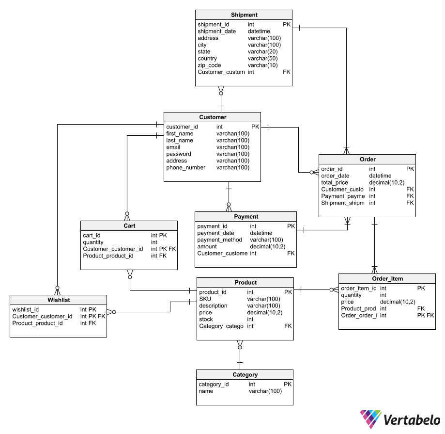
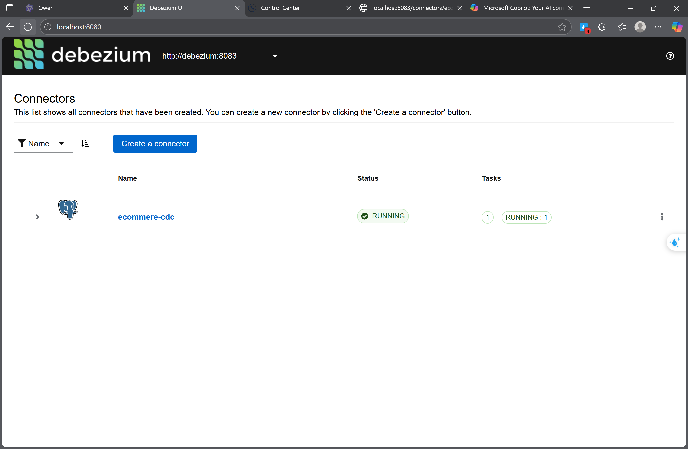
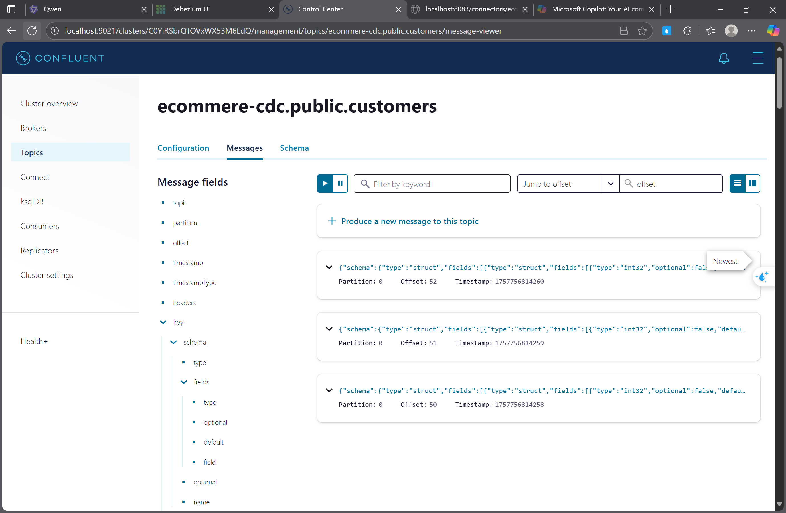

# READL TIME CUSTOMER BEHAVIOR RECOMMENDATION PLATFORM

## TABLE OF CONTENTS: 
1. [Generate database](#1-Generate-dataset)
2. [Configuration Capture Data Changes](#2-Configuration-capture-data-changes)

## 1. Generate dataset
### 1.1 Database Schema

The database includes the following entities based on the ERD:

- **Customer**: User account information
- **Product**: Product catalog with categories
- **Category**: Product categories
- **Order**: Customer orders with items
- **OrderItem**: Individual items in orders
- **Cart**: Shopping cart functionality
- **Wishlist**: Customer wishlist
- **Payment**: Payment processing
- **Shipment**: Order shipping information

### 1.2 Entity Diagram

>See more details about how to design the database: https://vertabelo.com/blog/er-diagram-for-online-shop/
### 1.3 Database Management
- I use the database with Docker, you can configure the database in the file: `/backend/.env` depending on your database.
- Or you can run the `postgres` service in the `docker/docker-compose-kafka.yaml` file
```bash
# Initialize Table Database
python backend/utils/init_db.py --init
# Reset Database (Drop and recreate tables)
python backend/utils/init_db.py --reset
```

### 1.4 Generate database
- Here, I will create fixed data for the tables Categories, Customers, Products: 
```bash
# Create 15 categories, 200 products, 100 customers
python backend/generate_data.py --categories 15 --products 200 --customers 100
# or use the default setting
python backend/generate_data.py
# Delete all data
python backend/generate_data.py --clear
```
### 1.5 User behavior simulation
- I will simulate user behavior to create data for the remaining tables.
- Specific actions:
  - **Browsing**: View products, browse categories
  - **Cart Management**: Add/remove products from the cart
  - **Wishlist**: Add favorite products
  - **Order Placement**: Place orders from the cart
  - **Payment**: Process payment (credit card, paypal, etc.)
  - **Shipping**: Create shipping information
- Weights for each action:
  ```python
    action_weights = {
        'view_product': 0.4,      # 40% view products
        'add_to_cart': 0.2,       # 20% add to cart
        'add_to_wishlist': 0.15,  # 15% add to wishlist
        'remove_from_cart': 0.1,  # 10% remove from cart
        'place_order': 0.1,       # 10% order
        'browse_category': 0.05   # 5% browse category
    }
    ```
- Follow code below: 
```bash
# Simulate 50 shopping session, each session 25 minutes
python simulate_user_behavior.py --sessions 50 --duration 25
# Create history data 30 days
python simulate_user_behavior.py --historical 30
# Delete all data
python simulate_user_behavior.py --clear
```
### 1.6 Check the data through the API: 
- Run fastapi app and access to `http://localhost:8000/docs`: 
```bash
python backend/main.py
```
#### Basic Endpoints
- `GET /` - Root endpoint with API information
- `GET /health` - Health check
- `GET /docs` - Interactive API documentation
#### Data Endpoints
- `GET /customers` - List all customers
- `GET /products` - List all products  
- `GET /categories` - List all categories
- `GET /carts` - List all carts
- `GET /orders` - List all orders
- `GET /order_item` - List all order_item
- `GET /wishlist` - List all wishlist
- `GET /payment` - List all payment

## 2. Configuration Capture data changes
### 2.1 Connect Debezium with PostgreSQL to receive any updates from the database
```shell
bash config/cdc-connect/run.sh register_connector config/cdc-connect/postgresql-cdc.json
```
- You should see the output similar to the below example
```shell
Registering a new connector from configs/postgresql-cdc.json
HTTP/1.1 201 Created
Date: Sat, 13 Sep 2025 06:59:18 GMT
Location: http://localhost:8083/connectors/ecommere-cdc
Content-Type: application/json
Content-Length: 524
Server: Jetty(9.4.44.v20210927)

{"name":"ecommere-cdc","config":{"connector.class":"io.debezium.connector.postgresql.PostgresConnector","database.hostname":"postgresql","database.port":"5432","database.user":"project_de_user","database.password":"project_de_password","database.dbname":"project_de_db","plugin.name":"pgoutput","database.server.name":"ecommere-cdc","table.include.list":"public.customers,public.products,public.order,public.order_items,public.categories","name":"ecommere-cdc"},"tasks":[],"type":"source"}
```
- To delete connector:
```shell
bash config/cdc-connect/run.sh delete_connector ecommere-cdc
```
> Conntector status `failed` on Debezium-ui. Access into `http://localhost:8083/connectors/[connector_name]/status` to view logs

- Access to debezium ui through link `http://localhost:8080`: 

### 2.2 Test capture change data
- Run code insert, update, delete data in database
```bash
python test/test_cdc.py
```
- Access control-center-ui through link `http://localhost:9021`, Topic -> ecommere-cdc.public.customers -> messages: 
- Or you can run the code snippet below to see the messages: 
```bash
python script/kafka_producer/check_kafka_topic.py
# you can run with the assigned topic to view messages in topic
python script/kafka_producer/check_kafka_topic.py --topic ecommere.public.orders
```



## 3. Flink jobs
### 3.1 Configuration 
